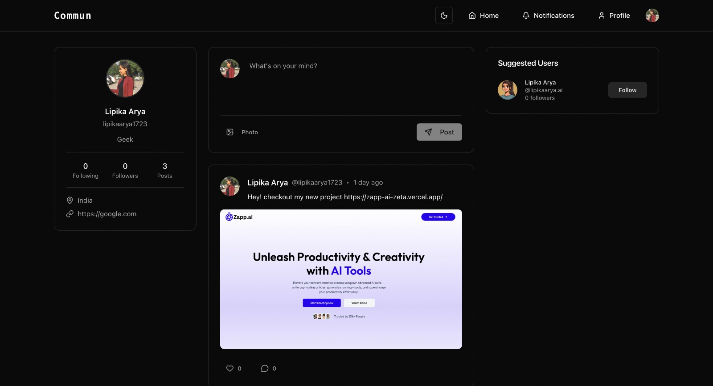
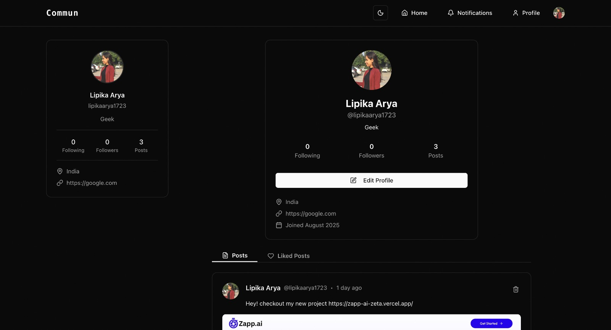
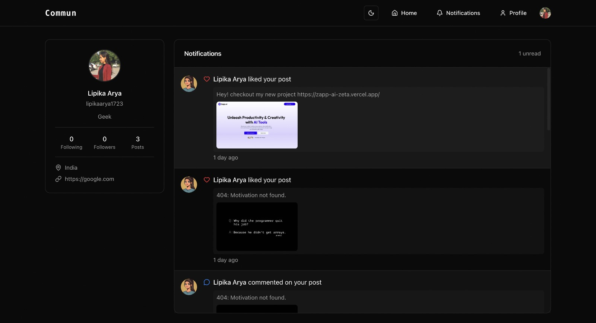

# 📱 Commun - Social Media App

**Commun** is a modern, full-stack social media application built with cutting-edge tools like **Next.js**, **ShadCN UI**, **Prisma**, **Tailwind CSS**, and **Neon DB**. It provides a sleek and interactive user experience with authentication, image uploads, notifications, and social interactions.


## 💻 Deployed App

👉 [Try it live!](https://commun-social.vercel.app/)

## 📸 Preview

### 📌 Landing Page


### 📌 Profile Page


### 📌 Notifications Page


## 🛠️ Tech Stack


- **Frontend:** [Next.js](https://nextjs.org/), [Tailwind CSS](https://tailwindcss.com/), [ShadCN UI](https://ui.shadcn.com/)
- **Backend:** [Prisma ORM](https://www.prisma.io/) with [Neon PostgreSQL](https://neon.tech/)
- **Authentication:** [Clerk](https://clerk.dev/)
- **File Uploads:** [UploadThing](https://uploadthing.com/)
- **Database:** [Neon PostgreSQL](https://neon.tech/)                 


## ✨ Features

- 🔐 **Authentication:** Sign up / Sign in using Clerk
- 👤 **User Profiles:** View and edit user profile pages
- 🔁 **Follow System:** Follow and unfollow other users
- 📝 **Posts:** Create and share posts with image support
- ❤️ **Likes & Comments:** Interact with posts through likes and comments
- 🔔 **Notifications:** Get notified for interactions like follows, likes, and comments


## 📦 Installation Guide

### ✅ Prerequisites

Before you begin, ensure you have the following installed:

- **Node.js** (v18 or later) – [Download](https://nodejs.org/)
- **npm** or **yarn** – Comes with Node.js
- **Git** – [Download](https://git-scm.com/)
- **Clerk account** – [Create one](https://clerk.dev/)
- **UploadThing account** – [Create one](https://uploadthing.com/)
- **Neon PostgreSQL database** – [Create one](https://neon.tech/)
- **Prisma CLI** (optional but recommended)

```bash
npm install -g prisma
```

### ⚙️ Clone the Repository

```bash
git clone https://github.com/lipika1911/Commun.git
cd commun
```

### 🔌 Install Dependencies

```bash
npm install
```

### 📝 Environment Variables

Create a .env file in the root directory and configure the following:

```env
DATABASE_URL = your_neon_db_url
NEXT_PUBLIC_CLERK_PUBLISHABLE_KEY = your_clerk_publishable_key
CLERK_SECRET_KEY = your_clerk_secret
UPLOADTHING_TOKEN = your_uploadthing_app_id
```

### 📊 Setup Prisma

```bash
npx prisma generate
npx prisma db push
```

### 🏃 Run the app

```bash
npm run dev
```

### ✅ You’re all set!
- Open http://localhost:3000 in your browser.
- Register a new user and start using Commun!
## 📬 Contact

For feedback, ideas, or collaborations, reach out:

- 💻 **GitHub:** [lipika1911](https://github.com/lipika1911)

## 📄 License

This project is licensed under the [MIT License](./LICENSE).


## 👩‍💻 About the Developer

Made with ❤️ by [Lipika](https://github.com/lipika1911)
